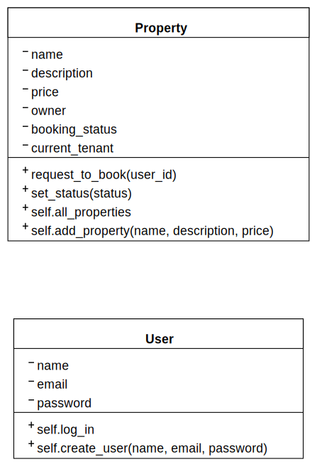
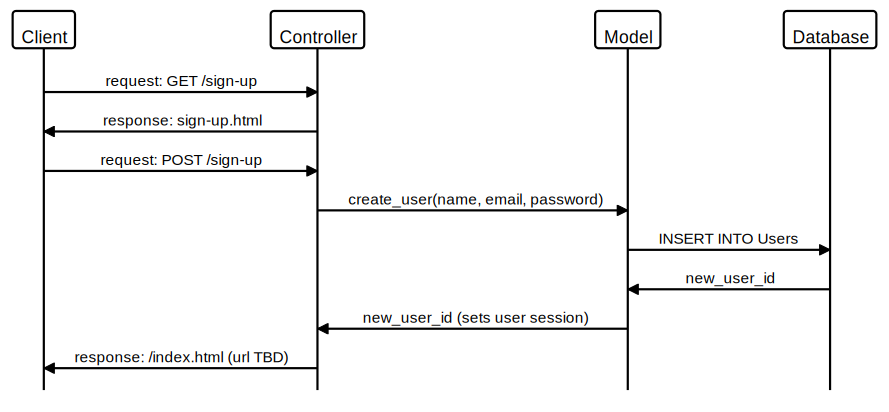
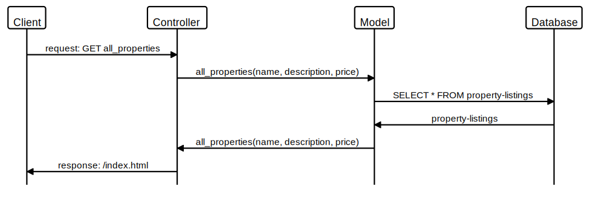

# Howdy Partners BnB - Makers Group Project

## Welcome to Howdy Partners BnB!

Your go-to place for the rootinist tootinist holiday homes in the wild west.

---

## About the project

Makers Academy requirement: "We would like a web application that allows users to list spaces they have available, and to hire spaces for the night."

## Specifications

We decided our Minimum Viable Product (MVP) specifications should be:

* User can sign up
* User should  log in
* User can list a new space.
* User can list multiple spaces
* Space can have name, description, and a price
* A user can request to hire any space
* Approval by the user that owns that space
* Owner can make space available manually

## Basic class diagram

## Control flow diagram - Sign up page

## Control flow diagram - View properties

